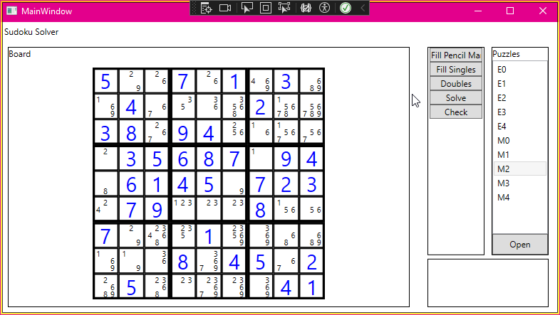

# SudokuSolver

This is a project to get me familiar with C# and WPF (mostly the WPF part).

It is my attempt to make a sudoku solver.  It applies increasingly more complex stratagies until it gets a solution, or it is unable to make any changes (get stumped).  Right now it just has the trivial stratagies avalible, along with using double pairs to elimitate pencil marks in other cell.  Just these are enough for it to solve many easy puzzles.  I plan to keep feeding it harder and harder puzzles, and each time it gets stuck add a new stratagie that handles the situation it got stuck at.

For the app itself I plan to have basic functionality to load puzzles, add values and pencil marks, run the full solver or run individual stratagies.

Currently it can:

- Load a list of files from a given path
- Select puzzles from that list to load
- Run diffrent stratagies on the puzzle
- Display the board with diffrent sizes for pencil marks and filled cell, and colored values for given cells
- Check if the board is a valid solution

Plans:

- Add more stratagies (maybe triples or y wings next)
- Menu to pick folder to load puzzles from
- Log output on UI
- Display invalid digits in red

